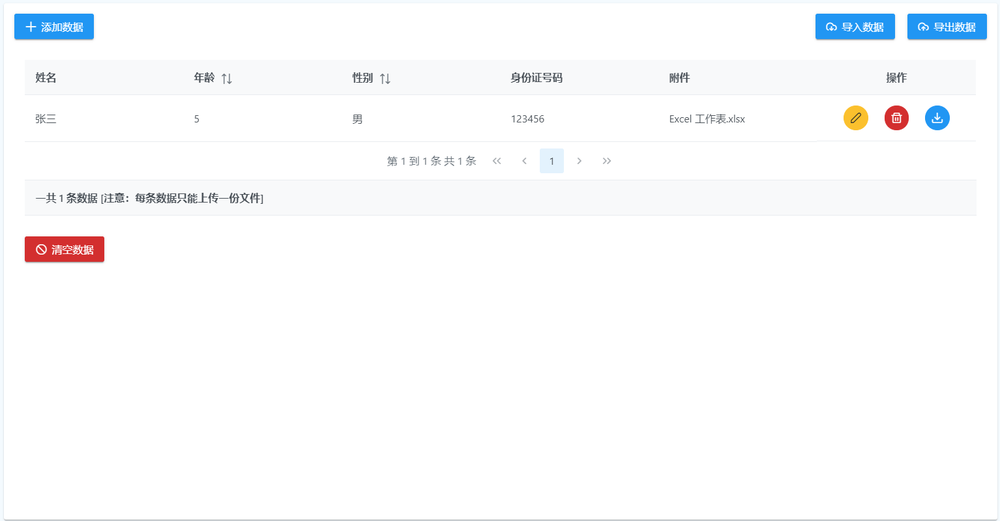

# Rxdb-Demo

**template：angular-electron**

说明：此 demo 包含对 `Rxdb` 数据库的增删改查操作，以及数据的导出与导出。

 - 依赖下载： `npm install`

 - 项目运行： `npm start`

 - 项目构建： `npm run electorn:build`

分支说明：`master` - 关于附件

 - 附件上传下载只局限于本机，数据导出 `exportJSON` 不包含当前数据库附件信息。

 - 每条数据 附件 只允许上传一份 [代码中做的限制]。

 - 附件下载 采用 `Blob -> ArrayBuffer -> Buffer -> write` [node]

**项目运行界面预览图**

